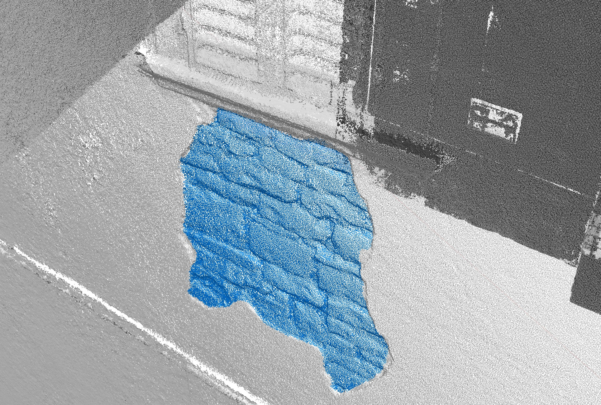

# Cesium-3D-Tile-ClassificationPrimitive

This repository contains a collection of Python and JavaScript scripts for testing and demonstrations on how to classify 3D tiled models. The primary focus of the repository is the use of **CesiumJS's `ClassificationPrimitive`** to dynamically highlight and style regions of interest. 


## Overview

Working with large 3D datasets, such as entire cities or complex infrastructure, demands efficient visualization and interaction. 3D tiled models are ideal for this, as they leverage Level of Detail (LOD) to optimize streaming and rendering performance without sacrificing visual quality.

Our primary goal with this project is to migrate and integrate classification information directly onto these 3D tiled models in CesiumJS platform, enriching the visual data with deeper insights. This repository demonstrates how to achieve dynamic visualization of analytical data, such as structural damage or specific areas of interest, directly on complex 3D models within a standard web browser.

### Project layout
```bash
HaMMon-UAV-digital-twin/
├── css/        
│   └── style.css 
├── js/            
│   ├── classification_primitive.js      # set classification primitive from geojson
│   ├── test_classification_primitive_from_geojson.js
│   └── test_classification_steps.js
├── scripts/       # Python scripts
│   ├── Export dense cloud coordinates/
│   │   ├── 1-exportEachPointCloudClassification.py # export .las for each class
│   │   └── 2-exportGeoJSON.py                      # export coordinates .las in GeoJSON used on CesiumJS
│   ├── extra-scripts/  # scripts test to export polygons and convex hull
│   └── Mesh Colorization/
│       ├── 1-countingClassificationPoints.py
│       ├── 2-exportPointCloudClassification.py
│       ├── 3-changeClassificationAndColor.py
│       └── 4-importPoint_exportModel.py            # generate a obj mesh colored on classification areas
├── shapes/ # Folder for geojson file
├── tiled/  # Folder for tiled file unziped
└── index.html  # Main code for running CesiumJS web app
```

## Methodological Approach

The workflow begins with 3D model creation and proceeds to classification integration:

**3D Tiled Model Creation:**
We use SfM (Structure from Motion) from drone-captured images to generate highly accurate 3D models and, crucially, to export them directly in 3D Tiles format (not included in this repository). Our intent is to leverage camera alignment for classification.

**Segmentation and Classification:**
Once the 3D model is obtained, Machine Learning (ML) models can be applied. These models (not included in this repository) are run on the original UAV images to segment specific areas, such as damaged zones, material types, or other features of interest. This phase generates "masks" that identify the classified regions.

**Coordinate Export and GeoJSON Format:**
From the ML-generated masks, we extract the coordinates of the underlying 3D point cloud within these masked areas. These coordinates are then exported in GeoJSON format for geographical data.

```json
{
  "type": "FeatureCollection",
  "name": "cloud_Water_3D",
  "crs": { "type": "name", "properties": { "name": "urn:ogc:def:crs:EPSG::4979" } },
  "features": [
    { "type": "Feature", "properties": { }, "geometry": { "type": "Point", "coordinates": [ 11.74440609, 44.07989222, 381.342 ] } },
    { "type": "Feature", "properties": { }, "geometry": { "type": "Point", "coordinates": [ 11.74440607, 44.07989212, 381.339 ] } },
    { "type": "Feature", "properties": { }, "geometry": { "type": "Point", "coordinates": [ 11.74440606, 44.07989215, 381.34 ] } },
    { "type": "Feature", "properties": { }, "geometry": { "type": "Point", "coordinates": [ 11.74440612, 44.07989213, 381.344 ] } },
    { "type": "Feature", "properties": { }, "geometry": { "type": "Point", "coordinates": [ 11.74440608, 44.07989211, 381.34 ] } },
    { "type": "Feature", "properties": { }, "geometry": { "type": "Point", "coordinates": [ 11.7444061, 44.07989214, 381.342 ] } }
    ... 
  ]
}
```
<p align="center">A snippet of a GeoJSON file representing a 3D point cloud.</p>

## CesiumJS Classification Primitive
The core of this project lies in leveraging CesiumJS's ClassificationPrimitive. This powerful feature allows you to dynamically apply styles and masks to 3D Tiles models, terrain, or other models present in the scene.

The process works like this:

**Classification Geometries (GeometryInstance):**
For each point in the GeoJSON file (representing a classified area), we create a small geometry, typically a `Cesium.EllipsoidGeometry` (a tiny sphere, e.g., 1 cm radius). Each of these geometries can be individually styled with specific colors and transparencies. These individual colored geometries serve as the "masks" we'll use to classify the 3D model.

**The ClassificationPrimitive:**
All these GeometryInstance objects are then grouped into a Cesium.ClassificationPrimitive. This primitive is specifically designed to interact with 3D Tiles. By setting the classificationType property to `Cesium.ClassificationType.CESIUM_3D_TILE`, the primitive uses the defined geometries to "color" or "classify" the underlying 3D Tiles wherever the geometries intersect.

This approach enables overlaying analytical information onto existing 3D models, such as structural damage or areas of interest, transforming raw data into an immediate and contextualized visualization.

## Usage
- Set tiled model in `tiled`
- Set geojson in `shapes/`
- Update `classification_primitive.js` to this changes
- Run a live server locally

## Example Result

The method was successfully validated by visualizing a 75,000-point fracture (1m x 1m) on a model of the Palazzo Maresa facade, providing clear and interactive visual emphasis on the classified area. The following image illustrates in blue the starting dense cloud classification obtained.



All coordinates of dense cloud from wall fracture have been saved in GeoJSON and converted in ClassificationPrimitive. Small yellow spheres generated from these points classify and visually highlight the fracture area on the 3D model tiled of the palace.


## License

The scripts in this repository are distributed under the terms of the MIT License. See the [LICENSE](LICENSE) file for details.

## Acknowledgements

This work is supported by Italian Research Center on High Performance Computing Big Data and Quantum Computing (ICSC), project funded by European Union - NextGenerationEU - and National Recovery and Resilience Plan (NRRP) - Mission 4 Component 2 within the activities of Spoke 3 (Astrophysics and Cosmos Observations).